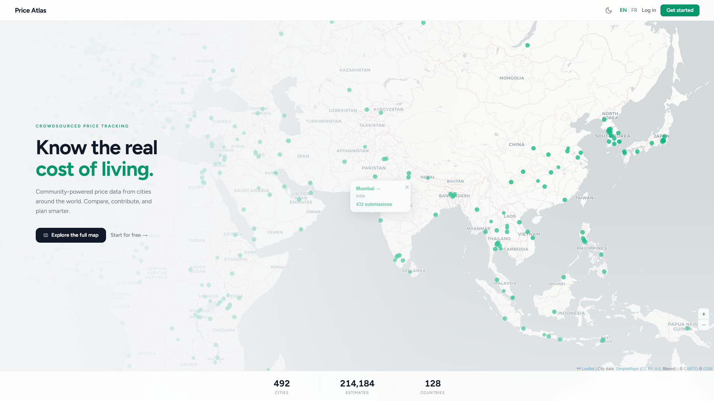
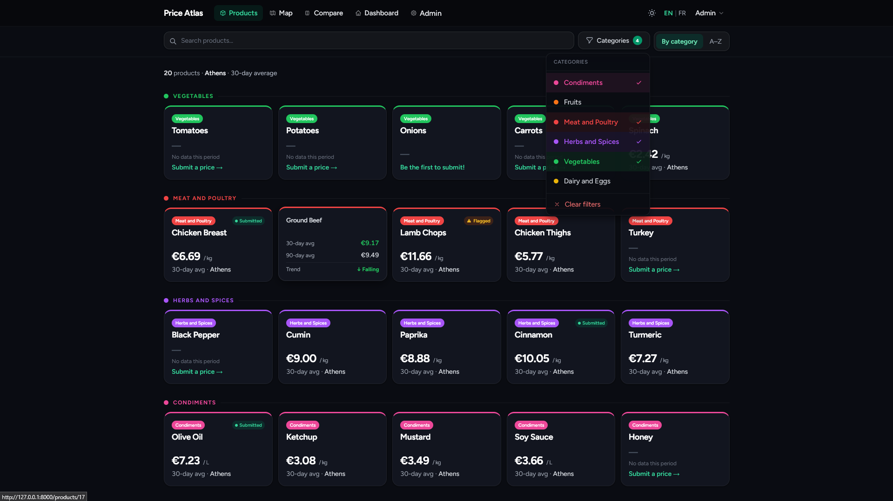
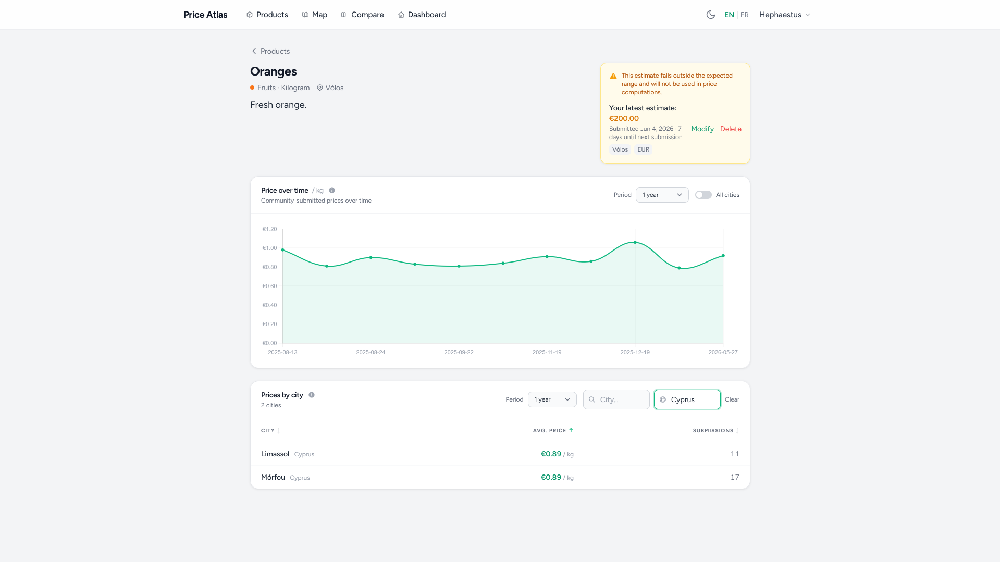
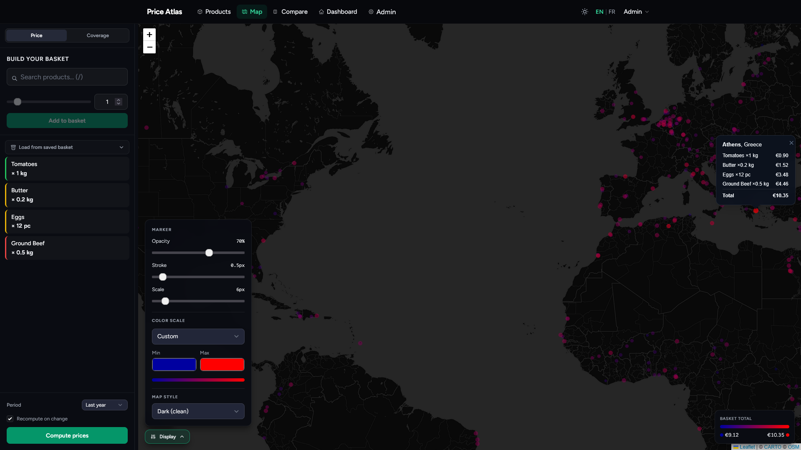
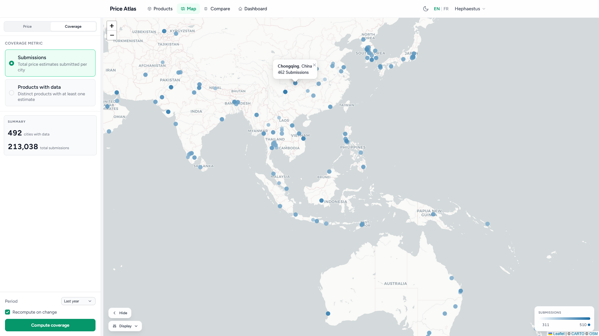
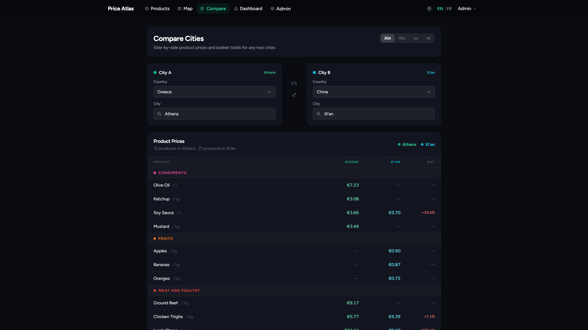
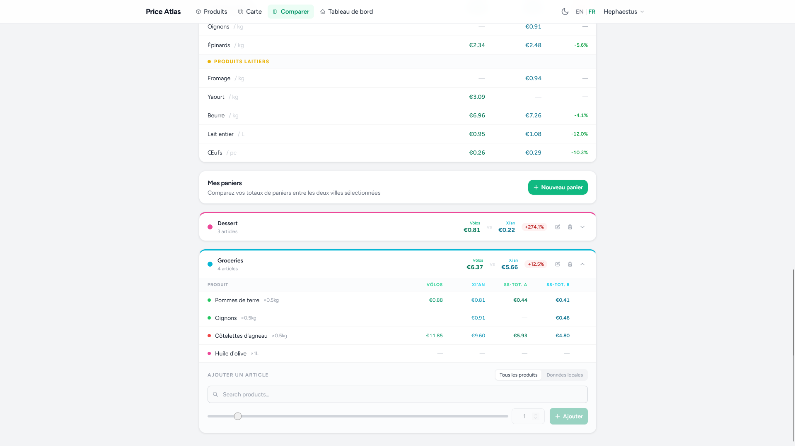
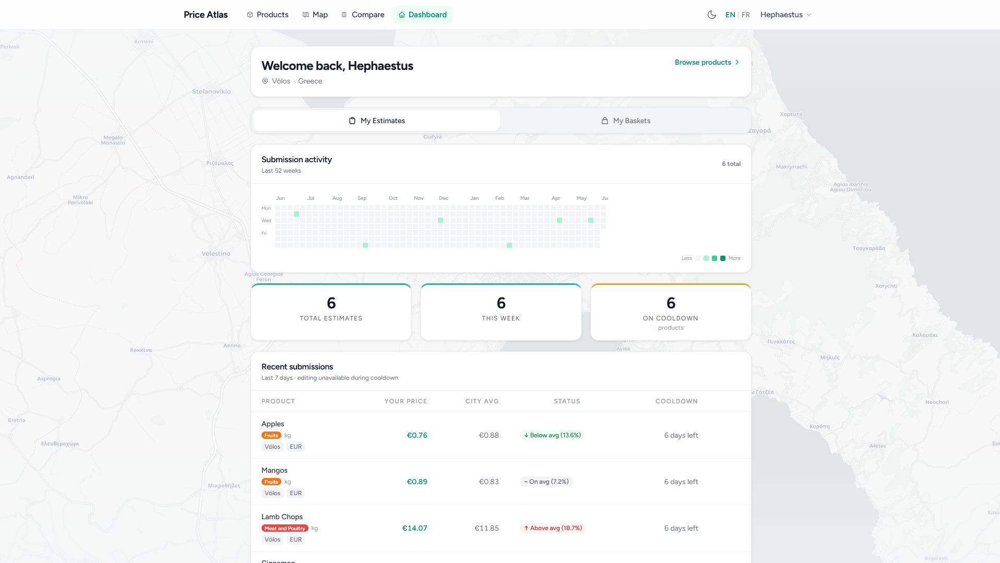
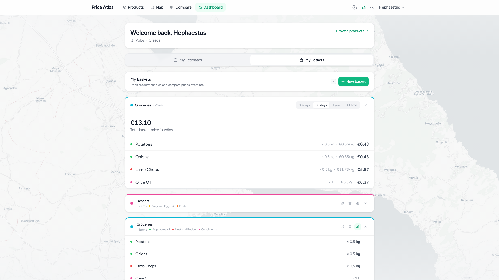
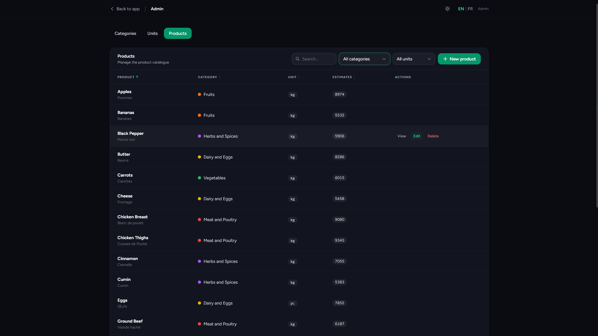

# Crowdsourced Prices

> Know the real cost of living with community-driven price tracking across cities worldwide.

A web platform where users submit and compare product prices across different cities and countries. Create your own basket of products and compare their prices globally, track price trends over time, and compare two cities side by side.

---

## Screenshots

### Landing Page



### Product Catalog



### Product Detail



### Interactive Map

#### Price Mode



#### Coverage Mode



### City Comparison

#### Product Table



#### Basket Prices per City 



### Dashboard

#### Submission Activity



#### Basket Prices Over Time



### Admin Panel



---

## Features

- **Price submissions:** submit prices for products in your city, with a 7-day cooldown per product
- **Outlier detection:** Filtering flags suspicious submissions without discarding them
- **Interactive map**: Leaflet map visualising total basket cost or data coverage per city, with customisable markers
- **City comparison**: pick any two cities and see a product-by-product price delta table and basket totals
- **Price trends**: Chart.js line chart of daily average prices per product
- **Saved baskets**: create and name shopping baskets to track the cost of specific product sets across cities
- **Currency conversion**: prices displayed in each user's preferred currency
- **Bilingual UI**: full English and French support; locale stored per user
- **Dark / light theme**: class-based Tailwind dark mode, persisted per user
- **Admin panel**: manage categories, units, and products with bilingual JSON name/description fields

---

## Tech Stack

| Layer             | Technology           |
| ----------------- | -------------------- |
| Backend framework | Laravel 12           |
| Reactive UI       | Livewire 4           |
| Styling           | Tailwind CSS 3       |
| JavaScript        | Alpine.js 3 + Vite 7 |
| Charts            | Chart.js 4           |
| Maps              | Leaflet 1.9          |
| Database          | MySQL                |
| Testing           | PHPUnit 11           |

---

## Getting Started

### Requirements

- PHP 8.2+
- Composer
- Node.js 18+ and npm

### Installation

```bash
# Clone the repo
git clone <repo-url>
cd crowdsourced-prices

# Install all dependencies, create .env, run migrations, and build assets
composer setup
```

### Running in Development

```bash
# Start Laravel server and Vite concurrently
npm run dev

php artisan serve
```

The app will be available at `http://localhost:8000`.

### Other Commands

```bash
# Reset the database and reseed with sample data
php artisan migrate:fresh --seed

# Format code
./vendor/bin/pint

# Interactive PHP REPL
php artisan tinker
```

---

## Project Structure

```
app/
  Livewire/               # All interactive UI components
  Models/                 # Eloquent models
  Services/
    PriceAggregator.php   # All price math (outlier detection, averages)
resources/
  views/
    livewire/             # Component Blade templates
    layouts/              # App, admin, and guest layouts
routes/
  web.php                 # All routes
database/
  migrations/
  seeders/
```

### Key pages

| URL                 | Description                                                        |
| ------------------- | ------------------------------------------------------------------ |
| `/`               | Public landing page with map and stats                             |
| `/catalog`        | Product grid with search and category filter (auth)                |
| `/products/{id}`  | Product detail — city prices, trend chart, submission form (auth) |
| `/map`            | Basket builder + city cost map (auth)                              |
| `/compare`        | Two-city price comparison with basket totals (auth)                |
| `/dashboard`      | Personal estimates, saved baskets, activity heatmap (auth)         |
| `/admin/products` | Admin product manager                                              |

### Notes

- Product and category names are stored as JSON (`{"en": "...", "fr": "..."}`) and resolved transparently by locale via the `HasTranslations` trait.
- `PriceAggregator` is a singleton service, all price calculations and outlier detection live there.
- Country and global averages are computed as means-of-city-averages.

## Credits

- City data from [SimpleMaps World Cities Database](https://simplemaps.com/data/world-cities), licensed under [CC BY 4.0](https://creativecommons.org/licenses/by/4.0/).
  The dataset was filtered and adapted, approximately 2500 cities were selected from the original ~52,000 entries based on population, language, and currency criteria.
